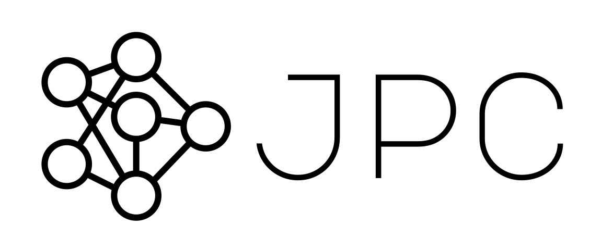
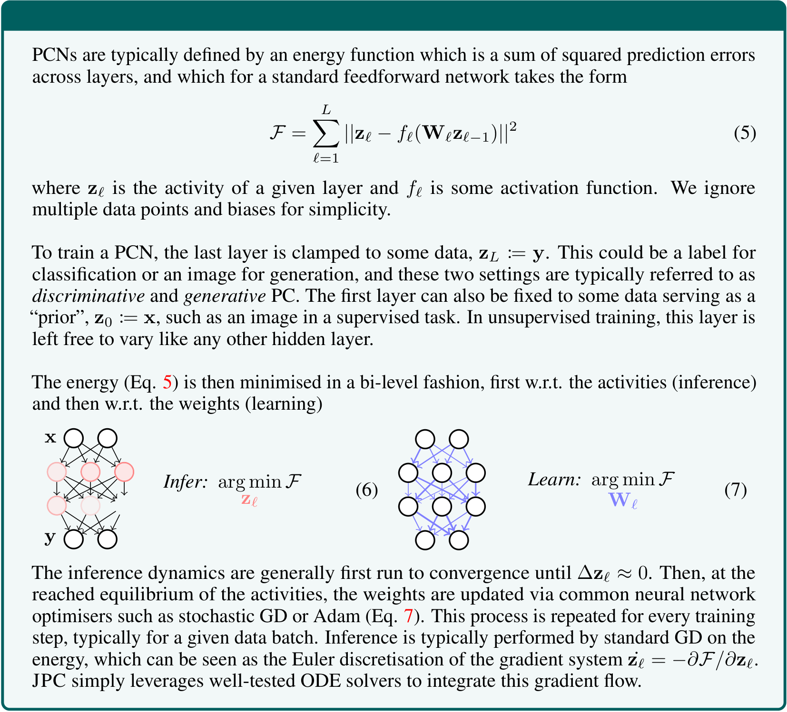

<p align='center'>
  <a href='https://thebuckleylab.github.io/jpc/'>
    
  </a> 
</p>

<h2 align='center'>🧠 Flexible Inference for Predictive Coding Networks in JAX ⚡️</h2>


JPC is a [**J**AX](https://github.com/google/jax) library for training neural 
networks with **P**redictive **C**oding (PC). It is built on top of three main 
libraries:

* [Equinox](https://github.com/patrick-kidger/equinox), to define neural 
networks with PyTorch-like syntax,
* [Diffrax](https://github.com/patrick-kidger/diffrax), to solve the gradient 
flow PC inference dynamics, and
* [Optax](https://github.com/google-deepmind/optax), for parameter optimisation.

JPC provides a **simple**, **fast** and **flexible** API for 
training of a variety of PCNs including discriminative, generative and hybrid 
models. 
* Like JAX, JPC is completely functional in design, and the core library is 
<1000 lines of code. 
* Unlike existing implementations, JPC leverages ordinary differential 
equation (ODE) solvers to integrate the gradient flow inference dynamics of PC 
networks (PCNs). 
* JPC also provides some analytical tools that can be used to study and
potentially diagnose issues with PCNs.

If you're new to JPC, we recommend starting from the [
example notebooks](https://thebuckleylab.github.io/jpc/examples/discriminative_pc/)
and checking the [documentation](https://thebuckleylab.github.io/jpc/).

## Overview
* [Installation](#installation)
* [Documentation](#documentation)
* [Quick example](#quick-example)
* [Advanced usage](#advanced-usage)
* [Citation](#citation)

## ️💻 Installation
```
pip install jpc
```

Requires Python 3.9+, JAX 0.4.23+, [Equinox](https://github.com/patrick-kidger/equinox) 
0.11.2+, [Diffrax](https://github.com/patrick-kidger/diffrax) 0.6.0+, and 
[Optax](https://github.com/google-deepmind/optax) 0.2.4+. 

For GPU usage, upgrade jax to the appropriate cuda version (12 as an example 
here).

```
pip install --upgrade "jax[cuda12]"
```

## 📖 [Documentation](https://thebuckleylab.github.io/jpc/)
Available at https://thebuckleylab.github.io/jpc/.

## 🧠 PC primer


## ⚡️ Quick example
Use `jpc.make_pc_step` to update the parameters of any neural network compatible
with PC updates (see the [notebook examples
](https://thebuckleylab.github.io/jpc/examples/discriminative_pc/))
```py
import jax.random as jr
import jax.numpy as jnp
import equinox as eqx
import optax
import jpc

# toy data
x = jnp.array([1., 1., 1.])
y = -x

# define model and optimiser
key = jr.PRNGKey(0)
model = jpc.make_mlp(key, layer_sizes=[3, 5, 5, 3], act_fn="tanh")
optim = optax.adam(1e-3)
opt_state = optim.init(
    (eqx.filter(model, eqx.is_array), None)
)

# perform one training step with PC
result = jpc.make_pc_step(
    model=model,
    optim=optim,
    opt_state=opt_state,
    output=y,
    input=x
)

# updated model and optimiser
model = result["model"]
optim, opt_state = result["optim"], result["opt_state"]
```
Under the hood, `jpc.make_pc_step`
1. integrates the inference (activity) dynamics using a [diffrax](https://github.com/patrick-kidger/diffrax) ODE solver, and
2. updates model parameters at the numerical solution of the activities with a given [optax](https://github.com/google-deepmind/optax) optimiser.

See the [documentation](https://thebuckleylab.github.io/jpc/) for more details. 

> **NOTE**: All convenience training and test functions such as `make_pc_step` 
> are already "jitted" (for optimised performance) for the user's convenience.

## 🚀 Advanced usage
Advanced users can access all the underlying functions of `jpc.make_pc_step` as 
well as additional features. A custom PC training step looks like the following:
```py
import jpc

# 1. initialise activities with a feedforward pass
activities = jpc.init_activities_with_ffwd(model=model, input=x)

# 2. run inference to equilibrium
equilibrated_activities = jpc.solve_inference(
    params=(model, None), 
    activities=activities, 
    output=y, 
    input=x
)

# 3. update parameters at the activities' solution with PC
result = jpc.update_params(
    params=(model, None), 
    activities=equilibrated_activities,
    optim=optim,
    opt_state=opt_state,
    output=y, 
    input=x
)
```
which can be embedded in a jitted function with any other additional 
computations. Again, see the [docs](https://thebuckleylab.github.io/jpc/) 
for details.

## 📄 Citation
If you found this library useful in your work, please cite (arXiv link):

```bibtex
@article{innocenti2024jpc,
    title={JPC: Flexible Inference for Predictive Coding Networks in JAX},
    author={Innocenti, Francesco and Kinghorn, Paul and Yun-Farmbrough, Will 
    and Singh, Ryan and De Llanza Varona, Miguel and Buckley, Christopher},
    journal={arXiv preprint},
    year={2024}
}
```
Also consider starring the repo! ⭐️ 

## 🙏 Acknowledgements
We are grateful to Patrick Kidger for early advice on how to use Diffrax.

## See also: other PC libraries
JAX-based:
* [pcx](https://github.com/liukidar/pcx)
* [pyhgf](https://github.com/ComputationalPsychiatry/pyhgf)

PyTorch-based:
* [Torch2PC](https://github.com/RobertRosenbaum/Torch2PC)
* [pypc](https://github.com/infer-actively/pypc)
* [pybrid](https://github.com/alec-tschantz/pybrid)
